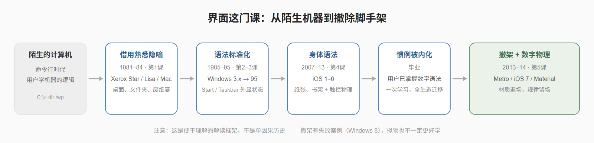
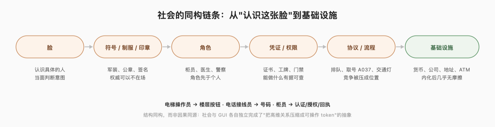

# 撤掉那张脸：界面如何教会社会认识新的主体

> **拟物（skeuomorphism）之于数字对象，可能类似于拟人化之于数字主体。** 早期 GUI 用熟悉的办公室物件教人类理解计算机；当这套交互语法被社会内化之后，界面撤掉了显式脚手架。今天 AI 界面大量使用头像、名字、声音、第一人称和人格——它很可能在做同样的事情：用"人"这个旧模型，解释一种新型的非人行动者。

---

## 一、一个反直觉的问题

先从一个问题开始：

**为什么 1984 年的黑白 Macintosh，其实比今天很多质感精良的 3D 界面更"拟物"？**

Macintosh 的屏幕上没有皮革、没有木纹、没有拟真按钮。它是黑白的，像素粗糙。但只要你把它和 iOS 6 放在一起看：便签纸做的 Notes、翻页的日历、木纹的 Game Center，就会意识到：我们对"拟物"这个词的理解，从一开始就太窄了。

如果我们把拟物拆成三层，历史会清晰很多：

- **语义拟物（semantic）**：Desktop、Folder、Trash、Clipboard——用旧世界的名词给数字对象命名分类。
- **行为拟物（behavioural）**：拖拽、翻页、滑动、扔进废纸篓——用旧世界的动作解释数字操作。
- **视觉拟物（visual）**：皮革、木纹、纸纹、高光倒角——在表面材质上假装自己是现实物件。

1984 年的 Macintosh 将前两层拉满、但第三层几乎没有（黑白屏幕也不允许）。iOS 6 三层俱强。iOS 7 之后的"扁平化"则砍掉的主要是第三层。**只是把拟物理解成"皮革和木纹"，必然会错过 GUI 最早、也最重要的认知工作。**

这个三层区分有一个学术锚点。Carroll、Mack 和 Kellogg 在 1988 年讨论界面隐喻时就指出：隐喻的作用是降低目标域的初始认知距离、帮助用户起步，但用户最终需要形成的，是对目标域本身的心智模型——对计算机本身的理解，而不是对办公室的怀念。隐喻是脚手架，不是目的地。

## 二、界面是一门课

顺着这个思路，UI 的历史可以解读成一张"人类计算课程表"。注意：这是一种**解读**，未必是设计者的本意——但几乎每个案例都有扎实的史料支撑。

**第一课：把机器的本体论（ontology）翻译成人的语言。** Xerox Star（1981）的革命性不在于"图标画得像"，而在于它改变了你面对计算机时的本体论：你面对的不再是程序、进程、存储结构，而是文档、文件夹、收/发件篮（in/out basket）、printer。

苹果 Lisa（1983）把简单（simplicity）和一体化（ integration）写进官方 UI 标准，将一致性当作降低学习成本的手段；Macintosh（1984）用 MacPaint 教直接操作、用 MacWrite 教 WYSIWYG（所见即所得）。

**第二课：GUI 语法标准化。** 早期的 Windows 1.0（1985）则更像 DOS 的视觉控制层；到 Windows 3.x，用户需要同时理解 Program Manager 和 File Manager 两套本体——"程序在哪里"和"文件在哪里"是两个问题。今天看来自然的 app/file 区分，曾经是必须被明确教授的知识。

**第三课：系统状态必须可见。** 这是全文史料支撑最充分的案例。Windows 95 的设计团队（Kent Sullivan 在 CHI 1996 上公开了完整的过程）通过易用性测试发现，新手真正的困难不是"找不到命令"，而是**系统状态不可见**：最小化一个窗口之后，那个任务仿佛消失了。任务栏的价值在于让"仍然存在的任务"持续可见；开始按钮则是把系统拓扑压缩成一个随时可以返回的大本营（home base）。

这里有一个鲜为人知的细节，我认为是整个 UI 史上最有教育意义的失败案例之一：Windows 团队做过一个 **Beginner Shell**：一个为新手极度简化的图形界面——精简版的桌面，而不是命令行——最后**主动放弃了**。原因有三：功能不全，用户迟早要退出；在简化界面里学到的东西迁移不到标准界面；等于要学两套系统。
这个失败案例的教训只有一句话：**脚手架不能与最终系统割裂。** 它几乎可以作为整篇文章的注脚。

**第四课：身体语法。** 2007 年电容多点触控刚出现时对大众是陌生的。iOS 1–6 的拟物，就是开头那张主屏，不只是在视觉上讨好用户，它在为一套全新的身体交互建立可预期的"物理规律"。通过融合现实中的知识，降低了新交互的语义距离。

**第五课：毕业，以及撤架。** Metro（2011）把 "原生数字化"（authentically digital）和 "重内容，轻界面"（content not chrome） 写进官方设计理念，明确反对为了传统而模拟现实控件。iOS 7 常被讲成"去拟物"，但这个说法不准确：它减弱的是物件层面的视觉写实（皮革、木纹），同时**增强了**运动、层级和半透明这类空间与行为的写实。真正的变化是：用户的"毕业"感来自交互语法的延续（UIKit 结构没动，换的是皮肤），于是显式脚手架可以撤掉一部分。

Material Design（2014）随后做了一个不一样的转变：设计团队用**真实纸张**做实验，观察光影和纸片的运动，再抽象成规则。这不是"iOS 6 式"的拟物——不是假装 Gmail 是一个皮革信封——而是从"模仿具体物件"转向"模拟物理规律"。

Fluent 的 Acrylic/Mica 同理：质感回来，但它承载的是层级、焦点和上下文，而不是"这是真的玻璃"。

这里必须插入两个限定，否则上面的叙事就是目的论了：

1. **拟物 ≠ 更好学。** 后续实证研究的结果并不一致：有研究发现老年用户在某些自然主义拟物界面上反而更困难，另一些研究又发现老年用户在扁平 UI 上的视觉搜索和可点击识别更差。关键变量是语义距离、熟悉度、可供性和约定俗成，而不是"像不像现实"本身。
2. **撤架也会失败。** Windows 8 把大量操作藏进边缘手势，discoverability 出了明显问题。结论是：只有当目标用户群已经内化了某个交互约定，撤掉提示才是安全的——"教育完成"从来不是全社会、全设备、全模态一次性完成的。

所以更准确的说法是：**当一个交互约定被某一目标群体广泛内化之后，显式提示的必要性可能下降。** 界面史不是单行线，是反复试验、有分叉、有回退的历史。

## 三、社会早就上过这门课

以上是界面的历史。但同样的抽象过程，社会本身已经进行了几百年。这一节提供社会学的论证基础，也承担全文一半的论证。

现代社会不断把"认识这张脸、当面判断这个人"的协作方式，改造成可以跨越陌生人、跨越时间地域的符号系统。一条链条：

几个例子，每个都值得停留几秒：

**钱。** 物物交换需要"双重欲望巧合"，而钱把劳动、债务、信用、承诺这些高维社会关系，压缩成一个双方都可操作的代币（token）：10 块钱。Giddens 把货币称作象征标志（symbolic token）：它可以在完全不依赖持有者身份的情况下跨时空流通。你不需要认识铸币厂厂长，也敢收这张钞票。

**制服、印章、证书。** 它们解决的是"远程权威"问题：主体不在场时，权威与承诺如何存续并被验证。你不需要认识这个穿制服的人，制服告诉你他的角色、机构和他能做的事。

**公司。** 这可能是整个论证里最强的先例。公司是一群人、资产、流程和合同的集合，但法律把它当作一个持续的、可识别的、能拥有财产和承担责任的主体——**一个不需要"一张脸"的社会行动者**。Blair（2013）和 Pollman（2021）在公司法文献里详细梳理了这种法律人格如何实现连续性、资产分割和内部治理。社会早就接受了一个没有身体、没有脸、但持续存在并行动的主体。

**交通和排队。** 没有信号灯的路口，陌生人靠眼神、手势和地位即时谈判；交通灯把路口变成协议——不需要互相了解就能高速协调。排队则是更微妙的压缩：谁更有权先获得服务，本来取决于身份、魅力、关系、音量甚至冲突，而队伍（以及取号机）把这个社会竞争压成了一个空间位置，再压成一个代币：**A037**。你手里的号码不认识你，也不需要认识你。

**电梯、电话、ATM。** 这三个是直接的界面先例。电梯曾经有操作员——一个理解你的目标、替你操作复杂设备的人。

自动控制成熟后，交互被压缩成楼层按钮、亮灯反馈和开关门：**"人 → 人 → 机器"变成了"人 → 界面 → 机器"**。电话曾经依赖接线员做路由——1918 年的交换台，是一个由人构成的"人肉路由器"层。号码系统把"帮我接那个人"变成可寻址的标识（addressable identifier）：电话号码是一种高度抽象、但被文化内化之后就几乎无摩擦的社会原语。

ATM 把柜员关系拆成认证、授权、交易、确认、回执五个形式化原语。

**官僚流程。** 现代组织把"找一个具体的人帮我解决"变成：提交表单、进入流程、拿到案件编号（case ID）、等待状态转换。这其实就是"社会 HCI"——组织内部的人和部门，被抽象成用户可见的状态机：已提交 / 审核中 / 待补充 / 已通过 / 已拒绝。

Giddens 给这个过程起过名字：**disembedding（脱嵌）**——社会关系从具体的、面对面的情境中被抽离出来，靠象征标志（symbolic tokens）和专家系统（expert systems）跨时空重组。注意一个关键事实：无脸不等于无人，而是很多协作不再要求每一方都有一张可见、熟悉、稳定的个人面孔。

那么把镜头转向 AI 之前，先留下社会学版本的核心设问，它同时是设计问题：

**当"脸"和"熟悉感"不再承担信任与协调的主要界面时，哪些信息必须被制度化地外显？** 候选答案：角色、凭证、权限、流程、历史、可问责性。

## 四、AI 现在上到哪一课了

这是文章必须最诚实的部分。前面大部分是史实和基于史实的解释；从这里开始，核心是**假说**——但它有坚实的心理学和传播学基础。

**基础一：人对机器自动使用社会规则。** Nass、Steuer 和 Tauber 1994 年的 CASA 研究（"Computers are Social Actors"）发现：人对计算机使用社会规则——礼貌、互惠、归因——**并不需要真的相信计算机是人**。这些反应是自动的、常见的。Reeves 和 Nass 在《The Media Equation》里把这一点系统化：媒体=真实生活。

**基础二：拟人是人类的默认设置。** Epley、Waytz 和 Cacioppo（2007）把拟人化（anthropomorphism）定义为"把人类的特征、动机、意图或情感赋予非人行动者"，并给出三类驱动：可用的人类知识、对效能和控制的动机、对社会联结的渴望。换句话说，给一个系统一张脸，是调用人类最成熟、最自动的认知系统——这是一种极低学习成本的"快速进入"界面。

**假说由此而来：** 头像、名字、声音、第一人称、"正在输入……"这些元素，可能是 AI 时代的拟物脚手架——用"人"的社会模型，去解释一种新型的智能体系统（agentic system）。就像 iOS 6 的皮革通讯录用"纸"解释 Notes 一样，今天的聊天助手用"人"解释一个并不具有连续人格、意图和记忆边界的系统。

而且人格化不是免费的。同一个 CASA 机制带来三个问题：

- **过度信任**：头像和声音提升的是熟悉感（familiarity）和温暖感（warmth），未必提升对真实能力边界的理解——它可能增加"感觉上的信任"，却不增加"恰当的依赖"（appropriate reliance——人与 AI 交互研究近年的核心概念，2024 年一篇 ACM 系统综述指出其定义和测量仍不统一，足见这是个真问题而非口号）。
- **错误归因**：用户会假定出并不存在的责任主体、连续意图和记忆边界。
- **社会偏见**：2026 年一项题为《Face value》的研究（全文见文末来源）发现，在 AI 教学场景中，导师头像的种族、性别、年龄线索会显著影响学习者感知到的专业度和对建议的采纳率。给 AI 一张脸，就把人类社会偏差的整个管道接进来了。

电梯操作员的类比在这里才真正显出分量：**今天 AI 助手的人格层，可能相当于电梯的"操作员阶段"**——在一个新技术的早期，用一个"人"做中介，帮助用户理解目标如何被完成；等交互语法成熟，这个中介就会被压缩成一组原语。当然，这是类比，不是预言。

## 五、从"它像谁"到"它被谁授权"

如果脚手架假说成立，成熟 AI 界面的方向就不是更逼真的人格，而是另一套机制的显式化。一组对照：

| 今天的 Face UI | 未来的 Role UI |
| --- | --- |
| 脸（头像） | 角色（role） |
| 魅力（personality） | 能力边界（competence boundary） |
| 身份气质（identity） | 凭证（credential） |
| 对话（conversation） | 委托状态（delegation state） |
| 信任感（trust feeling） | 可审计性与可控性（auditability / control） |

落到具体界面，一个"机构化"的智能体名片可能长这样：

注意这张卡片里没有名字、没有头像、没有"你好呀！"。它告诉你的是：**它是谁授权的、能做什么、做到哪里为止、出了事查哪里、怎么一键撤销。** 这就是制服和工牌逻辑，不是人格逻辑。

再往下是一组可能的智能体界面原语（agentic UI primitives）——相当于当年 GUI 的 select / open / drag / drop / undo：

- **Delegate**：交出目标、范围、截止时间和资源边界，而不是逐句指挥。
- **Inspect**：查看计划、证据、工具调用过程。
- **Authorize / Constrain / Approve**：显式的授权、约束和批准门——花钱、发送、删除、发布之前，系统必须停下来。
- **Verify**：溯源。这个事实来自原始资料、模型推断、还是未经验证？
- **Pause / Revoke / Handoff**：暂停、撤销、交接，交接时带着上下文和溯源记录。
- **Audit**：完整行动账本——意图 → 计划 → 工具调用 → 副作用 → 证据。
- **Declare uncertainty**：不要只给一个"87% 置信度"，而要展示**哪类任务可靠、哪类输入容易出错、缺了哪些条件、哪些部分无法验证**。

还有两个值得单独说的模式。一是 **Delegation Breadcrumb**：当任务在多个智能体之间流转时，界面显示完整的委托链——"你 → 项目主管智能体 → 采购智能体 → 供应商系统"——每层显示能力与责任边界，而不是让用户以为自己在和一个"人"聊天。

二是 **Human Handoff**：当智能体到达能力边界，界面显示"需要转交：法务 / 财务 / 人类主管"，而不是继续用人格话术撑住场面。

## 六、必须说的反对意见

把反对意见写进正文，是这个选题能否成立的关键。至少五条：

1. **UI 风格变化主要是审美、品牌和技术驱动的，不是教育。** GPU、高分屏、设计潮流、差异化竞争都在起作用。回应：脚手架应该被写成"一种机制"，而不是历史的唯一因果。
2. **拟物并不总是更好学。** 前文已述，实证结果不一致。关键变量不是"像不像现实"，而是语义距离与约定俗成。
3. **人类社会从来不是纯"基于脸"的。** 更准确的说法是：面对面熟悉感曾在小规模互动中占更高比重，现代制度不断扩展"与缺席的陌生人协作"的范围。是比重变化，不是从零到一的替换。
4. **AI 可能永远需要人格。** 陪伴、心理支持、教育、创意协作这些场景，可能长期从社会临场感中获益。去脸化不是所有场景的终点，而是高委托、高问责场景中的一条设计分化——这不是退步，是分工。
5. **无脸的制度也可能更不可控。** 官僚系统、金融系统、算法系统的历史警告我们：抽象化可能带来不透明和责任的模糊。目标不是越抽象越好，而是把信任从表层的社会线索，转移到**可见的权限、来源、流程、申诉、撤销与责任**上。

## 七、结尾

回到开头的问题。1984 年的 Macintosh 比今天的 3D 界面更拟物，因为它的拟物发生在语义和行为层——它教你的不是"这个东西长得像纸"，而是"你可以像对待桌上的东西一样对待它"。那套教学完成之后，界面可以撤掉脚手架，用纯数字的方式表达层级、状态和关系。

历史的另一侧，社会用几百年完成了同样的课程：把"认识这张脸"变成制服、印章、货币、公司、协议和状态机。每一次抽象都伴随着不适，也都创造了前所未有的协作规模。

而今天，AI 正顶着一张脸进入社会。头像、名字、"我正在输入……"——这些可能都是脚手架，和皮革通讯录是同一种东西。

GUI 的成熟，让我们不再需要把数字对象伪装成现实物体。
Agent UI 的成熟，也许会让我们不再需要把数字行动者伪装成一个人。

**从"它像谁"，到"它在什么制度关系里、拥有什么行动权、为什么可信或不可信"——这可能就是这门课的下一章。**

它既是一个假说，也是一个可以检验的研究议程：新手是否确实通过人格线索更快上手、同时更容易高估系统的连续意图？熟练用户撤掉人格线索后表现是否不变甚至更好？在高责任场景里，角色/权限/溯源界面是否比温暖的人格界面更能带来恰当的依赖？

这些问题现在都有答案的话，这篇就只是评论。它们现在没有——所以这是一张邀请函。

---

## 附：关键来源

- Hutchins, Hollan & Norman (1985), Direct Manipulation Interfaces: https://vis.csail.mit.edu/classes/6.859/readings/pdfs/Hutchins-DirectManipulationInterfaces.pdf
- Carroll, Mack & Kellogg (1988), Interface Metaphors and User Interface Design
- Sullivan (1996), The Windows 95 User Interface: A Case Study in Usability Engineering, CHI: https://dl.acm.org/doi/10.1145/238386.238611
- Smith et al. (1982), Designing the Star User Interface, Byte
- Nass, Steuer & Tauber (1994), Computers are Social Actors: https://doi.org/10.1145/259963.260288
- Epley, Waytz & Cacioppo (2007), On Seeing Human: DOI: 10.1037/0033-295X.114.4.864
- Reeves & Nass (1996), The Media Equation
- Baird & Maruping (2021), The Next Generation of Research on IS Use, MIS Quarterly
- Appropriate trust / reliance 系统综述 (2024): https://doi.org/10.1145/3696449
- Face value: How avatar identity shapes epistemic trust in AI-mediated learning (2026): https://www.sciencedirect.com/science/article/pii/S2666920X2600072X
- Microsoft, Guidelines for Human-AI Interaction (CHI 2019)
- Blair (2013), Corporate Personhood and the Corporate Persona: https://scholarship.law.vanderbilt.edu/faculty-publications/18/
- Pollman (2021), Corporate Law and the Myth of the Shareholder: https://scholarship.law.vanderbilt.edu/vlr/vol74/iss6/5/
- Stanford Encyclopedia of Philosophy, Money: https://plato.stanford.edu/entries/money-finance/
- Microsoft Windows User Experience Guide（Metro 设计原则）；Apple iOS 7 Transition Guide；Google Material Design 官方回顾

## 附：图片来源与许可

本文绘制的概念图（`assets/fig_*.png`，SVG 源文件同目录）：fig_gui_curriculum、fig_social_chain、fig_role_card、fig_delegation_breadcrumb，可自由使用。

历史照片与截图（均来自 Wikimedia Commons，嵌入前已逐一验证直链可访问）：

- iOS 6 主屏（iPod touch 4G 实拍）：CC BY 4.0 — https://commons.wikimedia.org/wiki/File:IPod_Touch_4G_running_iOS_6.1.3_showing_the_Home_Screen.jpg
- Xerox Star 8010 桌面图标：CC BY 2.0 — https://commons.wikimedia.org/wiki/File:Desktop_icons_for_Xerox_Star_8010.jpg
- Windows 3.x Program Manager：Public domain — https://commons.wikimedia.org/wiki/File:Windows_for_Workgroups_3.11_Mened%C5%BCer_program%C3%B3w.png
- Windows 95 桌面（Start 菜单展开）：CC0 — https://commons.wikimedia.org/wiki/File:Windows95pl.png
- iOS 7 锁屏：Commons 判定 Public domain（苹果 UI 截图版权有争议，使用风险自担）— https://commons.wikimedia.org/wiki/File:IOS_7_Lockscreen.png
- Material You 界面示例：CC BY 4.0 — https://commons.wikimedia.org/wiki/File:Material_you_light.png
- 1861 年 5 美元 Demand Note：Public domain — https://commons.wikimedia.org/wiki/File:US-$5-DN-1861-Fr.1.jpg
- 1917 年电梯操作员（Martha Washington 酒店）：Public domain（Library of Congress）— https://commons.wikimedia.org/wiki/File:Elevator_girl,_Martha_Washington_Hotel_in_1917.jpg
- 1918 年 Ohio Bell 交换台：Public domain — https://commons.wikimedia.org/wiki/File:Ohio_Bell_Telephone_Company_1918_CP01090-Garfield_Branch_Interior_-_DPLA_-_6a356e5d9ab1849c89786bfac3ae0462.jpg

未找到自由许可来源、主动放弃的素材：Macintosh System 1 真实桌面截图、iOS 6 皮革 Notes 界面、Metro 真实截图、1967 年第一台 ATM 照片——均因版权原因不采用（可另行向权利方申请授权）。
