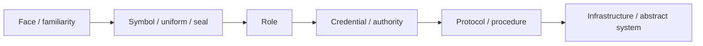
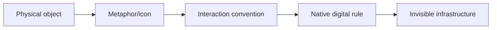

# 社会同态总览：从 face-work 到 abstract systems

> **证据标签**
> - **[史实]**：有原始资料、官方文档或学术文献直接支撑。
> - **[解释]**：基于多条史实做出的分析性归纳，不等于当事设计团队的原话。
> - **[假说]**：可检验的理论延伸，尤其用于 AI-native UI 部分。
> - **[限制]**：与主叙事相冲突、限制其外推范围、或提醒避免后见之明的证据。

## 核心类比

现代社会反复进行一种抽象：把必须依赖“认识具体的人、当面判断其意图”的协作，转成可以跨陌生人、跨时间、跨地域运作的符号、角色、凭证、协议和制度。

这与 GUI 的抽象有结构同态：

## 相关理论词

- Giddens：disembedding、symbolic tokens、expert systems、face-work / absent others。
- Luhmann：trust 作为降低社会复杂度的机制。
- Weber：legal-rational authority、impersonal rules、office/role。
- 法人理论：corporation 作为与其参与者相分离的法律人格/持续主体。

## 最适合用在设计类比的案例

1. 钱：trust abstraction。
2. 制服/证书/印章：role + credential visualization。
3. 公司：distributed humans → one persistent social/legal actor。
4. 交通：interpersonal negotiation → protocol coordination。
5. 电梯/电话/ATM：human operator → standardized interface。
6. 排队/取号/case ID：social contest → state machine / position。
