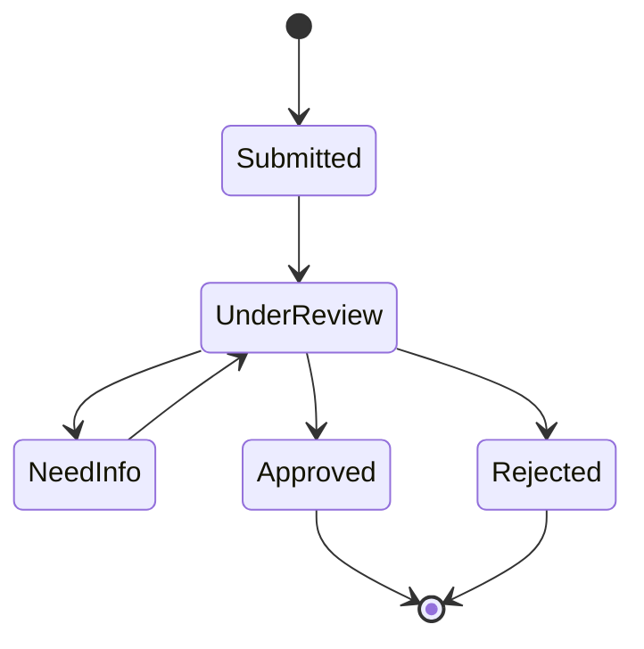

# 官僚制与 Case ID：社会关系如何被做成状态机

> **证据标签**
> - **[史实]**：有原始资料、官方文档或学术文献直接支撑。
> - **[解释]**：基于多条史实做出的分析性归纳，不等于当事设计团队的原话。
> - **[假说]**：可检验的理论延伸，尤其用于 AI-native UI 部分。
> - **[限制]**：与主叙事相冲突、限制其外推范围、或提醒避免后见之明的证据。

现代组织常把“找一个具体的人解决”转为：提交表单、进入流程、获得 case ID、等待状态转换。

**[解释]** 这是一种社会 HCI：复杂组织的内部人员、部门、审批链被抽象成用户可见的 state machine。

Giddens 关于 abstract systems / absent others 的讨论尤其适合解释这种现象：我们日常依赖大量从未见过的参与者与专家系统。
可参看：https://www.sciencedirect.com/science/article/abs/pii/S0263237315000778

## 对 agent 的启发

agent 的 UI 不一定要暴露“它的人格”，而可以暴露：

- current state
- queued action
- waiting dependency
- approval gate
- failure reason
- escalation path

这比“正在思考……”更接近可治理的行动系统。
